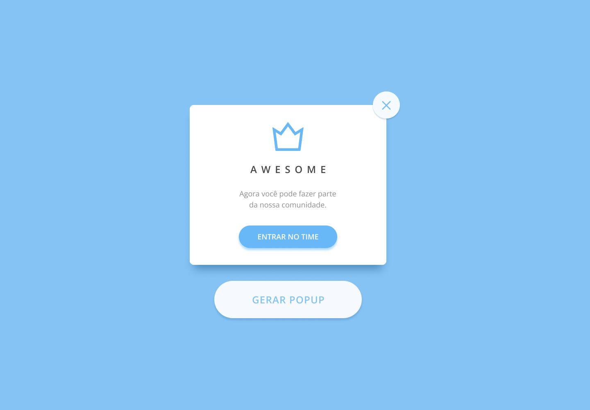

# Popup Card

### Links

- Veja o resultado: [Link](https://santos2408.github.io/popup-card/)

### Construído com

- Marcação semântica de HTML5
- CSS Grid
- Mobile-first workflow

### O que aprendi

Iniciei esse projeto com o objetivo de praticar a utilização de Javascript, entender um pouco mais de manipulação de DOM, refatoração de código, event bubbling e event delegation.

<!-- ### Ideias futuras -->

<!-- [ ] Gerar popup's com diferentes estilos -->

## Autor

<!-- - Website - [Add your name here](https://www.your-site.com) -->
- Roger Santos - [@rogersantos](https://www.linkedin.com/in/roger-santos-77a84810b/)

## Inspirações

- Design do Projeto: [Oleg Frolov](https://dribbble.com/shots/2348203-Pop-up)